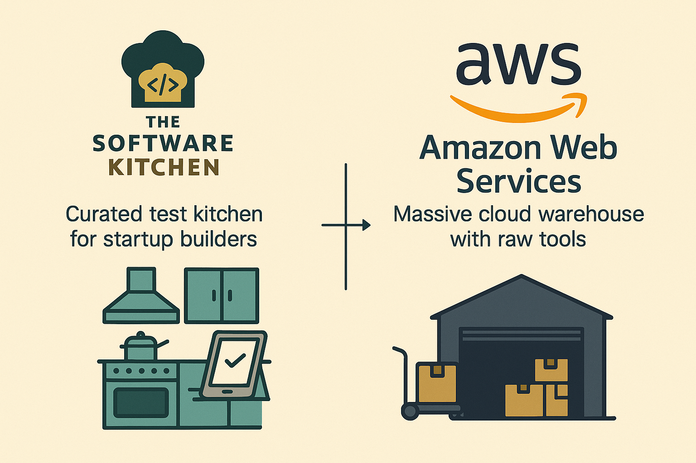

# 🧑‍🍳 The Software Kitchen by Bluenerd

Welcome to the **Software Kitchen**, where business-minded builders can launch useful cloud-based tools without writing code or managing AWS complexity.

This repo contains documentation, templates, diagrams, and guides related to the Software Kitchen platform.

---

## 🍱 What Is the Software Kitchen?

The Software Kitchen is a curated space for startup founders and solo builders to:

- Choose from **pre-built starter kits** (like a lead catcher or client onboarding flow)
- Configure them with your branding and secrets
- Deploy to your own AWS account **without writing Terraform or Lambda code**

No need to learn IAM, VPCs, or CI/CD. Just pick a kit, add your ingredients, and launch.

---

## 🏭 How Does It Relate to AWS?

Think of AWS as the **industrial cloud warehouse**—powerful but overwhelming.  
The Software Kitchen is your **test kitchen** built on top of it:

| Software Kitchen                           | AWS Cloud                                                   |
|--------------------------------------------|-------------------------------------------------------------|
| Meal kits for founders                     | Bulk ingredient warehouse                                   |
| Simple UI and one-click deploys            | CLI, YAML, and Terraform complexity                         |
| Secure handling of API keys and secrets    | Requires deep IAM and SSM knowledge                         |
| Pre-integrated Lambda + RDS + S3           | Raw infrastructure and service endpoints                    |

---

## 📦 This Repo Contains

- 📐 Architecture diagrams (Visio & PNG)
- 📖 Docs on MVP planning, CI/CD, and starter kit design
- 💬 Naming conventions and best practices
- 🚧 Work in progress content for GitHub/Zube integration

> Want to contribute or request a kit? Submit an issue or reach out.

---

## 🧠 More Coming Soon

This is the documentation brain of Bluenerd’s Software Kitchen platform.  
The infrastructure lives in [`bluenerd-infra`](https://github.com/YOUR_ORG/bluenerd-infra).  
The frontend lives in [`bluenerd-frontend`](https://github.com/YOUR_ORG/bluenerd-frontend).

Stay tuned.

---

